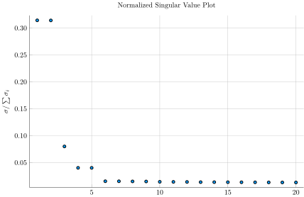
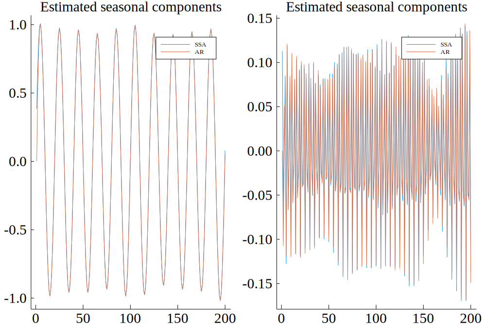
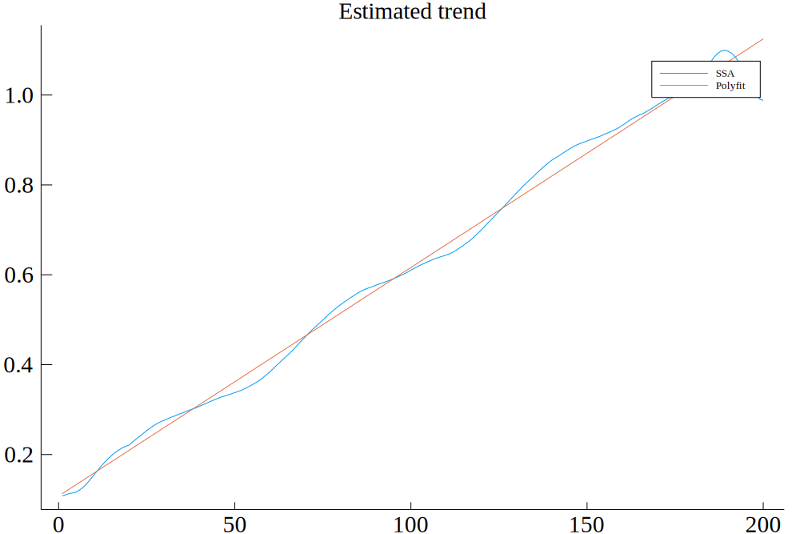
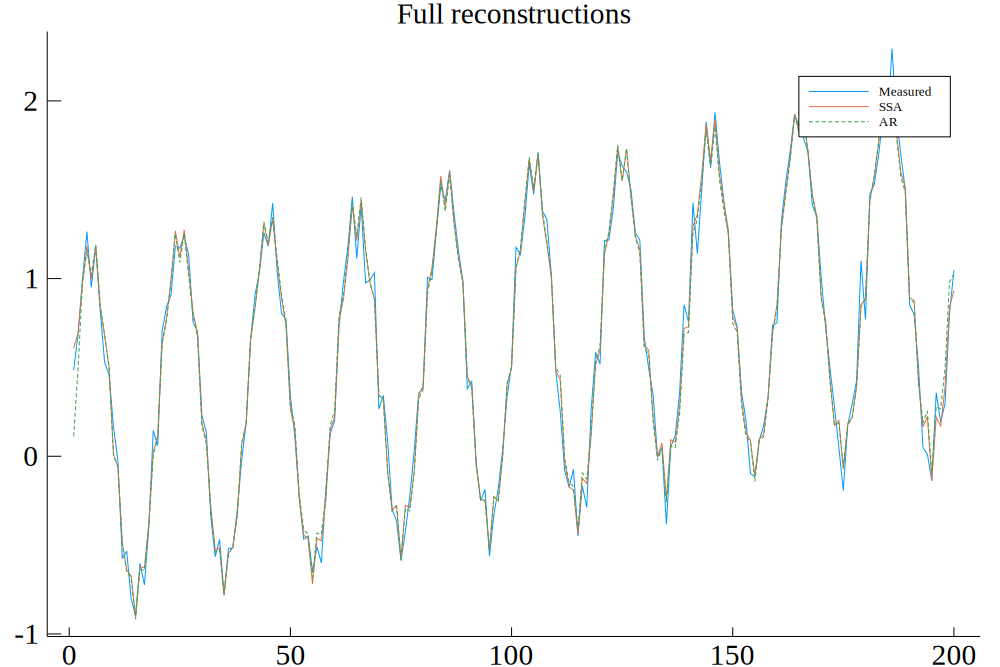

# SingularSpectrumAnalysis
[](https://github.com/baggepinnen/SingularSpectrumAnalysis.jl/actions)
[](https://codecov.io/gh/baggepinnen/SingularSpectrumAnalysis.jl)

A package for performing Singular Spectrum Analysis (SSA) https://en.wikipedia.org/wiki/Singular_spectrum_analysis

## Simple Usage
The example below creates a simulated signal that has two strong seasonal components. The main entry function is `analyze(y,L)` that returns the trend and seasonal components. `y` is the signal to decompose and `L` is a window length to use for the internal embedding (this should be as long as the longest expected period).
```julia
using SingularSpectrumAnalysis, Plots
# generate some data
L   = 20                      # Window length
K   = 100
N   = K*L;                    # number of datapoints
t   = 1:N;                    # Time vector
T   = 20;                     # period of main oscillation
y   = sin.(2pi/T*t);          # Signal
y .+= (0.5sin.(2pi/T*4*t)).^2 # Add another frequency
e   = 0.1randn(N);            # Add some noise
yn = y+e;
# plot(ys)

yt, ys = analyze(yn, L, robust=true) # trend and seasonal components
plot(yt, lab="Trend")
plot!(ys, lab="Season")
```
The `robust` keyword makes the analysis robust against large, sparse outliers, at the expense of longer computational time.

### ESPRIT
- `esprit(x, L, r; fs=1, robust=false)` Estimates `r` (positive) frequencies present in signal `x` using a lag-correlation matrix of size `L`.

## Advanced usage
Internally a Hankel matrix is formed and the SVD of this is calculated. The singular values of the SVD can be plotted to manually determine which singular value belongs to the trend, and which pairs belong to seasonal components (these are always pairs).
```julia
USV = hsvd(yn,L,robust=false) # Perform svd on the trajectory matrix, robust uses a robust version of svd, resistant to outliers
plot(USV, cumulative=false) # Plot normalized singular values
```


```julia
seasonal_groupings = [1:2, 4:5] # Determine pairs of singular values corresponding to seasonal components
trend_i = 3 # If some singular value lacks a buddy, this is a trend component
# trend_i, seasonal_groupings = autogroup(USV) # This uses a heuristic
pairplot(USV,seasonal_groupings) # plot phase plots for all seasonal components
yrt, yrs = reconstruct(USV, trend_i, seasonal_groupings) # Reconstruct the underlying signal without noise, based on all identified components with significant singular values
yr = sum([yrt yrs],dims = 2) # Form full reconstruction
plot([y ys yr], lab=["y" "ys" "ys" "yr"])
```

## Forecasting
We provide the function `fit_trend(yt, order)` to fit an n:th order polynomial to the trend:
```julia
yt, ys = analyze(yn, L)
A,x = fit_trend(yt, 1)
```
This returns the regressor matrix `A` and the polynomial coefficients `x`. This fit can be used to forecast the trend. To forecast the seasonal components, we make use of the package [ControlSystemIdentification.jl](https://github.com/baggepinnen/ControlSystemIdentification.jl) to fit AR(na) models. We create a simulated signal to test with:
```julia
using Random
Random.seed!(0)
L = 20
K = 10
N = K*L;
t = 1:N;
T = 20;
y = sin.(2pi/T*t);            # Add seasons
y .+= (0.5sin.(2pi/T*4*t)).^2 # Add seasons
y .+= LinRange(0,1,N)         # Add trend
e = 0.1randn(N);
yn = y+e;                     # Add noise
```
Next, we use SSA to find the trend and the seasonal components
```julia
yt, ys = analyze(yn, L) # trend and seasons
using ControlSystemIdentification
pd  = PredictionData(yt, ys, trend_order=1, ar_order=2)
yth = trend(pd)
ysh = seasons(pd)
```
Next, we visualize the trends and seasonal components estimated by both SSA and AR models.
```julia
plot(ys, layout=size(ys,2), lab="SSA", title="Estimated seasonal components")
plot!(ysh, lab="AR")
```


```julia
plot(yt, lab="SSA", title="Estimated trend")
plot!(yth, lab="Polyfit")
```


```julia
yr = yt+sum(ys, dims=2)
plot(yn, lab="Measured", title="Full reconstructions")
plot!(yr, lab="SSA")
plot!(+(yth, ysh...), subplot=1, lab="AR", l=(:dash,))
```


To perform `n`-step prediction, use the function `pred`:
```julia
pd = pred(pd,2) # Predict two steps
yth = trend(pd)
ysh = seasons(pd)
```
The example above is implemented in [`forecast.jl`](https://github.com/baggepinnen/SingularSpectrumAnalysis.jl/blob/master/test/forecast.jl).

## Missing data / outliers
See the keyword argument `robust`. The robust estimation is handled by [TotalLeastSquares.jl](https://github.com/baggepinnen/TotalLeastSquares.jl) which performs a robust PCA of the Hankel matrix. This factorization handles large but sparse outliers very well. To indicate that a value is missing, you can set it to some large value that is very far from the other values and it will be identified as an outlier by the robust factorization. To obtain the inferred values for the missing data, call the low-level function directly
```julia
X = hankel(y,L) # Form trajectory matrix
X̂, E = rpca(X)
ŷ = unhankel(X̂)
```
Where `ŷ` is a clean version of the signal. The sparse matrix `E` contains the estimated noise values. See also function `lowrankfilter` which packages this procedure.

See further documentation and examples [here](https://github.com/baggepinnen/TotalLeastSquares.jl#missing-data-imputation).

## Advanced low-level usage
See the implementation of functions `hsvd` and `reconstruct`

## Reading
See http://www.jds-online.com/files/JDS-396.pdf for an easy-to-read introduction to SSA
